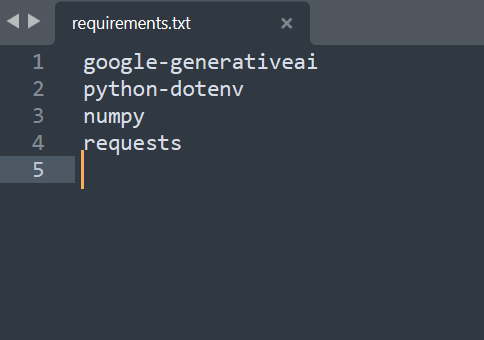

## Instalación de paquetes necesarios

Dado que este workshop es la continuación de los dos anteriores, se asumirá que ya deben tener instalado ``Python``, ``Django`` y ``Pillow``.

Adicional a estas librerías, vamos a instalar lo siguiente:

- ``google-generativeai``: Librería para acceder a modelos de inteligencia artificial
-  ``python-dotenv``: Manejo de api_keys de forma segura
-  ``numpy``: Operaciones matemáticas y de álgebra lineal
-  ``requests``: Consultas a algunas API de openAI

Abra el archivo ``requirements.txt``. Notará que este archivo tiene la siguiente estructura:

 

  
  

En este archivo se deben listar todas las librerías necesarias para el funcionamiento del proyecto. Si se necesita una versión específica de alguna librería se debe especificar de la siguiente forma:

``numpy==1.20.1``

Por ahora, dado que no requerimos versiones específicas, se puede dejar el archivo como está.

Después, desde la consola ubicada en la carpeta donde se encuentra el archivo ``requirements.txt`` escriba lo siguiente:

``pip install -r requirements.txt``

 

  
  

Después de unos segundos la instalación debe quedar completa.

Puedes verificar con el siguiente comando pip si estan instalados todos los paquetes necesarios

``pip list``

**RECUERDA:** Si estás usando un entorno virtual (virtualenv), asegúrate de activarlo antes de ejecutar el comando para ver los paquetes instalados en ese entorno.

Como mas adelante utilizaremos HuggingFace, crea una cuenta en dicha pagina para posteriormente
generar el token (https://huggingface.co/welcome):

Una vez creada, instala el paquete y accede al apartado de tokens.
``pip install huggingface_hub`` 

Vamos a settings/Access tokens

y generaremos nuestro nuevo token:

Le ponemos un nombre y le otorgamos los permisos necesarios: 

Bajamos, creamos y copiamos el codigo del token **(guardalo en el archivo .env de tu proyecto!)**

